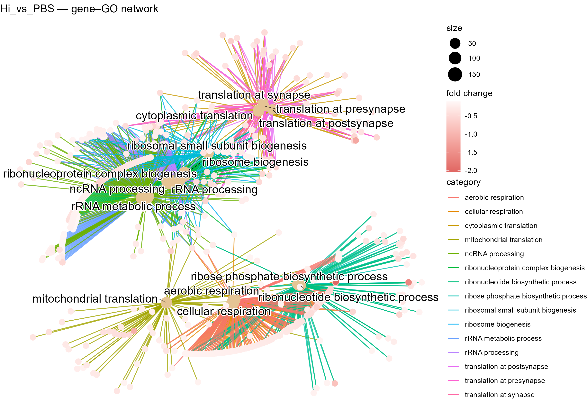
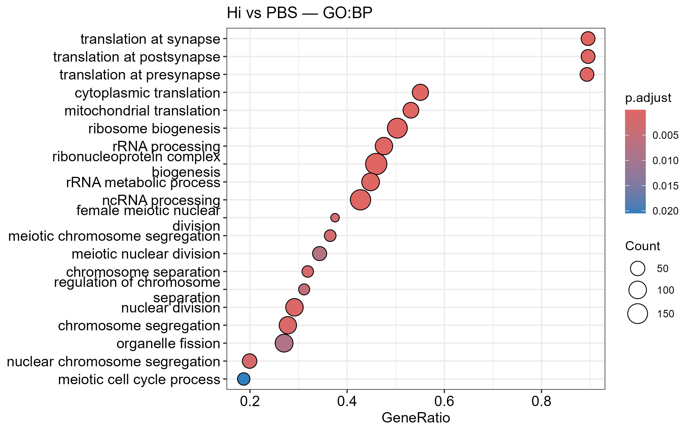
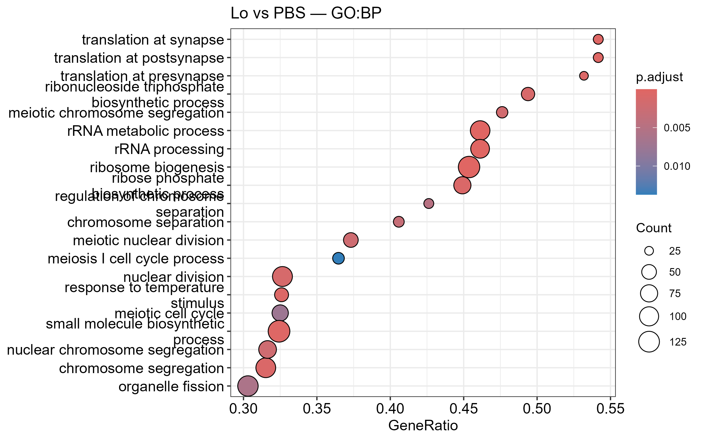
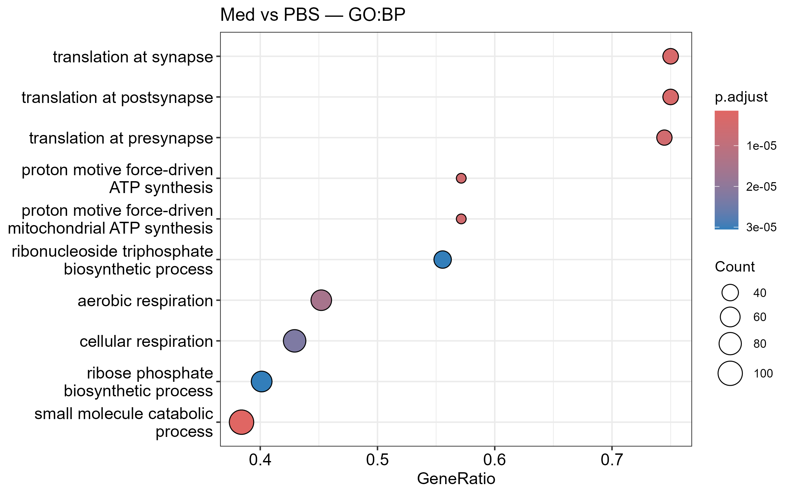
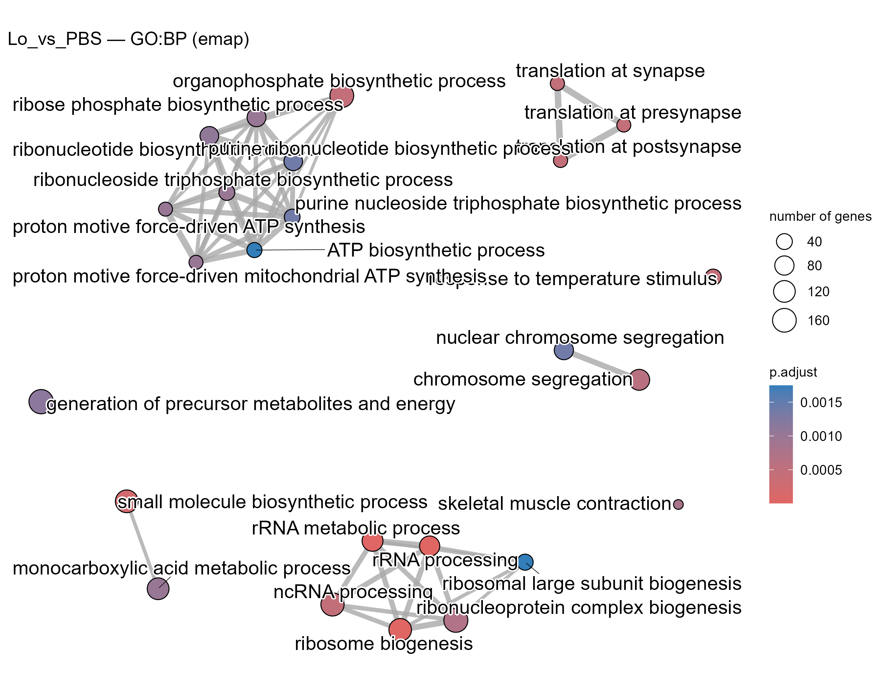
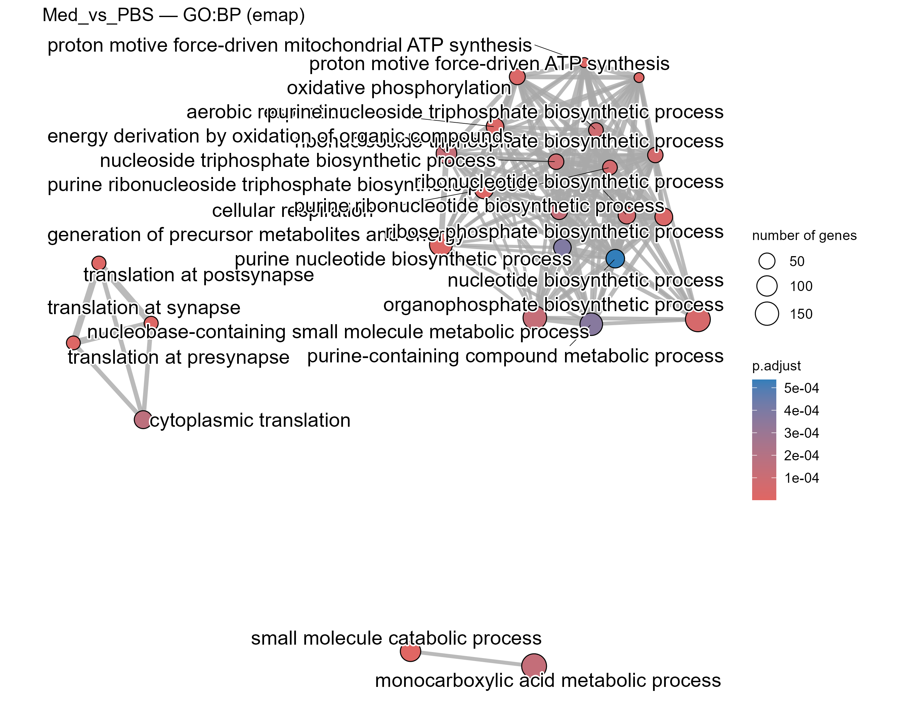

# GO:BP Enrichment Figures — RNA-seq Analysis
This folder contains GO:BP enrichment visualization plots with brief explanations.

---
### cnet Hi vs PBS GO:BP

**Category network (cnetplot)** for Hi vs PBS. Links show genes shared across enriched GO:BP terms. Node color intensity corresponds to enrichment significance.

---
### cnet Lo vs PBS GO:BP

**Category network (cnetplot)** for Lo vs PBS. Links show genes shared across enriched GO:BP terms. Node color intensity corresponds to enrichment significance.

---
### cnet Med vs PBS GO:BP

**Category network (cnetplot)** for Med vs PBS. Links show genes shared across enriched GO:BP terms. Node color intensity corresponds to enrichment significance.

---
### dotplot gseGO Hi GO:BP

**GO:BP dot plot for Hi** — Significantly enriched biological processes are shown by GeneRatio (x-axis). Dot size corresponds to the number of genes, and color to adjusted p-value. Enriched terms mainly involve translation and ribosome assembly.

---
### dotplot gseGO Lo GO:BP

**GO:BP dot plot for Lo** — Each point represents a significantly enriched biological process. The x-axis shows enrichment score, point size corresponds to gene count, and color indicates adjusted p-value.

---
### dotplot gseGO Med GO:BP

**GO:BP dot plot for Med** — Each point represents a significantly enriched biological process. The x-axis shows enrichment score, point size corresponds to gene count, and color indicates adjusted p-value.

---
### emap Hi vs PBS GO:BP

**Enrichment map** for Hi vs PBS. Nodes are GO:BP terms; edges connect terms sharing many genes. Clusters highlight related biological themes.

---
### emap Lo vs PBS GO:BP

**Enrichment map** for Lo vs PBS. Nodes are GO:BP terms; edges connect terms sharing many genes. Clusters highlight related biological themes.

---
### emap Med vs PBS GO:BP

**Enrichment map** for Med vs PBS. Nodes are GO:BP terms; edges connect terms sharing many genes. Clusters highlight related biological themes.

---
