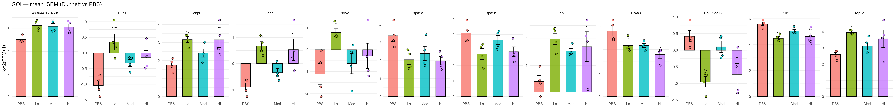

# GOI Figures — RNA-seq Analysis
This folder contains figures summarizing results for selected **Genes of Interest (GOI)**.

---
### Goi Barjit Dunnett Auto12

**Bar plot (with jittered points)** Each panel shows one top gene of interest (GOI) identified from the differential-expression analysis. Expression values are log₂-transformed CPMs, plotted by treatment group (PBS, Lo, Med, Hi). Bars represent mean ± SEM; points are individual samples. Statistical markers (e.g. *, ***) indicate significance versus PBS (Dunnett’s test).

Genes such as Gm43879, Gm44432, Gm44853, and Gm48700 display strong up-regulation in Lo–Hi groups relative to PBS, suggesting induction of inflammatory or translational programs consistent with the GO:BP enrichment results (e.g. ribosome biogenesis, translation at synapse). Other genes, like 9330121K16Rik and Mir15a, remain repressed under PBS and show graded activation with increasing LPS dose, highlighting a dose-responsive pattern.

---
### Goi Heatmap Auto12

**Heatmap** Rows are genes; columns are samples.  Each row represents a GOI and each column a sample, colored by relative expression (red = higher, blue = lower). Most genes (e.g. Gm44432, Gm43879, Gm48700) show coordinated up-regulation in Lo–Hi groups compared with PBS, consistent with activation of translational and ribosomal pathways highlighted in the GO:BP enrichment and GOI-zoom analyses.

---
### Goi Violin Auto12

**Violin plot** Each violin shows the expression distribution across samples for PBS, Lo, Med, and Hi groups. Genes such as Gm43879, Gm44432, and Gm48700 exhibit clear up-regulation in Lo–Hi conditions relative to PBS, mirroring the patterns observed in the bar-plot (mean ± SEM) and heatmap. These consistent dose-dependent increases align with the translational and ribosomal activation highlighted by GO:BP enrichment.

---
