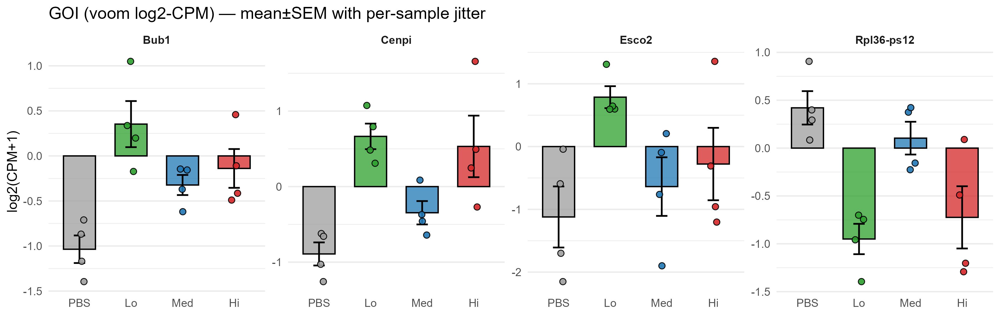

# GOI Zoom Figures — RNA-seq Analysis
This folder provides detailed visualizations ('zoomed-in') for selected **Genes of Interest (GOI)** and their overlaps across contrasts. Selected genes are Bub1, Cenpi, Esco2, Rpl36-ps12.

---
### Goi Bar Jitter Focus

**Bar plot with jittered points** highlighting zoomed expression of GOI across conditions. Bars indicate group means, and dots represent individual sample values to illustrate variability.

---
### Goi Correlation Heatmap

**Correlation heatmap** showing pairwise relationships between expression profiles of GOI. Colors indicate correlation strength; high positive correlations appear in red or yellow tones.

---
### Goi Lollipop Logfc

**Lollipop plot** summarizing log2 fold changes for each GOI. Length of the stem reflects the magnitude of change; direction indicates up- or down-regulation.

---
### Up Overlaps Bar

**Bar plot with jittered points** highlighting overlap counts between groups.

---
### Venn Goi Vs Lo Down

**Venn diagram** showing overlaps between gene sets (e.g., DEGs or GOI subsets) across indicated contrasts. Shared regions represent genes common to multiple groups.

---
### Venn Goi Vs Lo Up

**Venn diagram** showing overlaps between gene sets (e.g., DEGs or GOI subsets) across indicated contrasts. Shared regions represent genes common to multiple groups.

---
### Venn Up Lo Med Hi

**Venn diagram** showing overlaps between gene sets (e.g., DEGs or GOI subsets) across indicated contrasts. Shared regions represent genes common to multiple groups.

---
