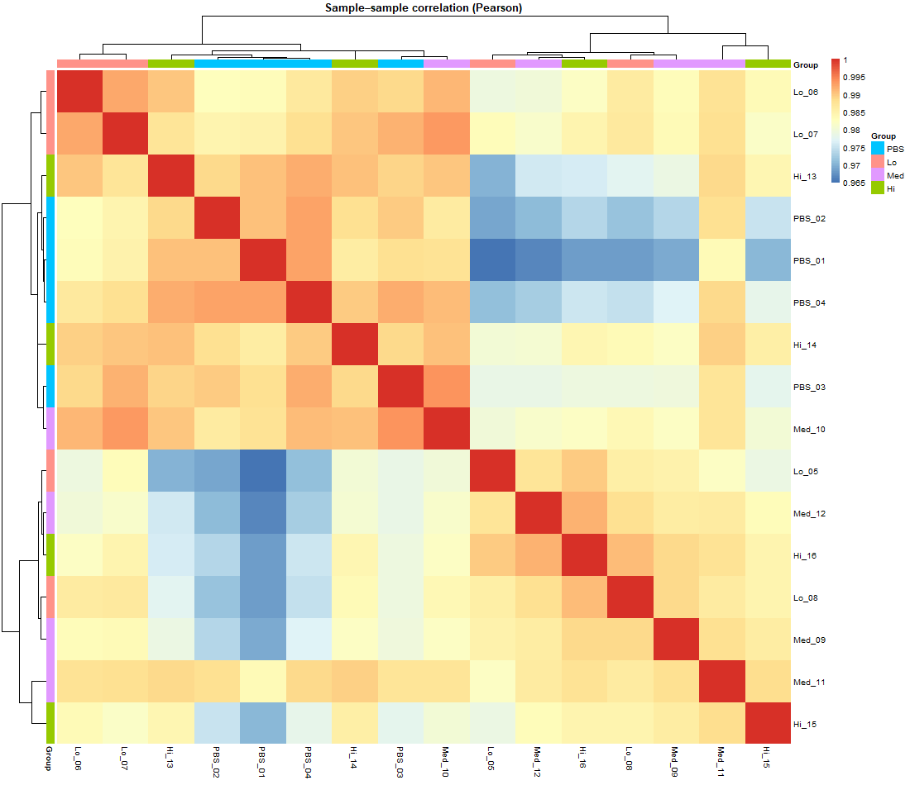
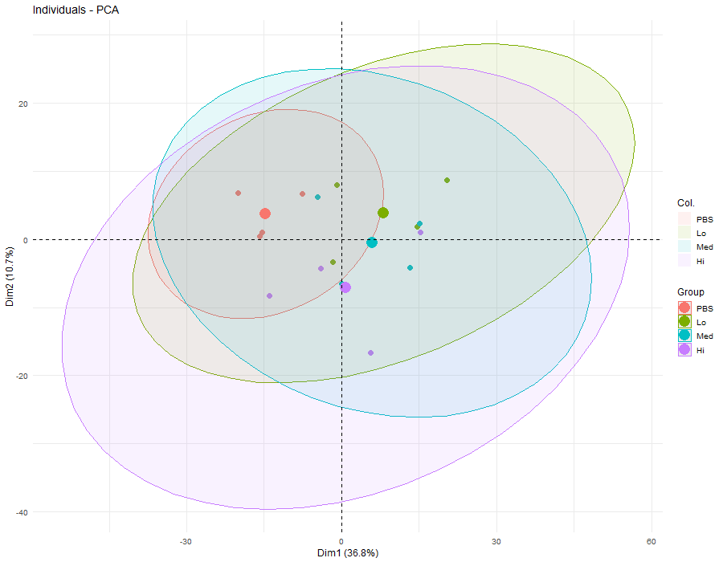
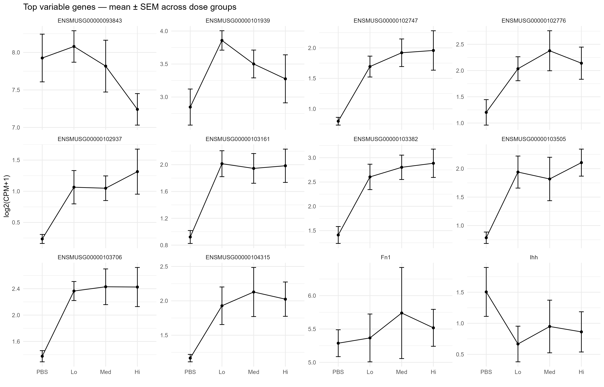
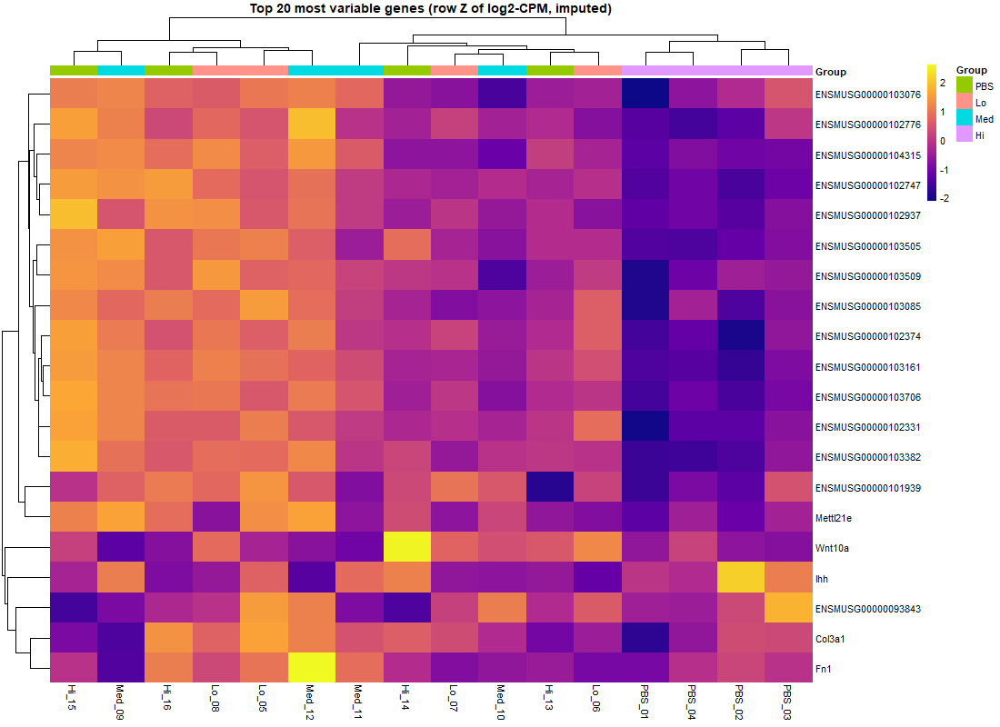
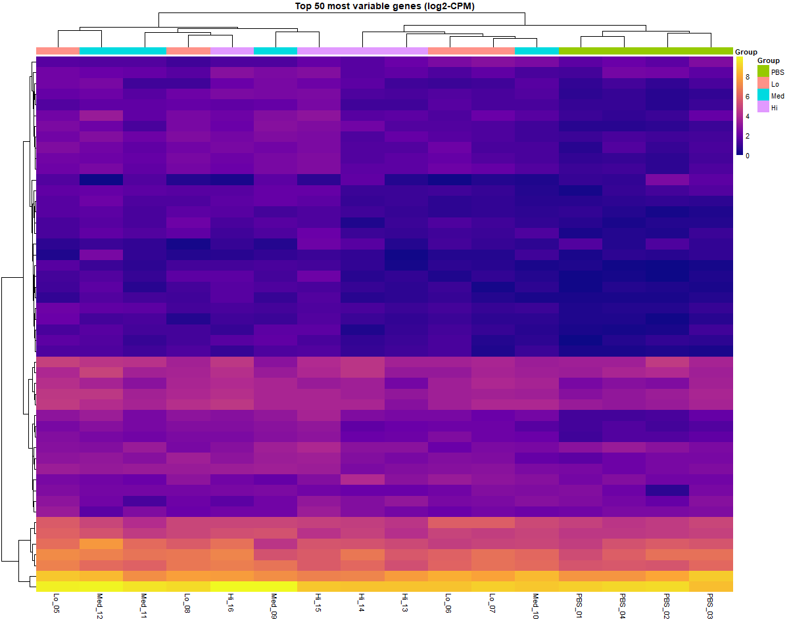
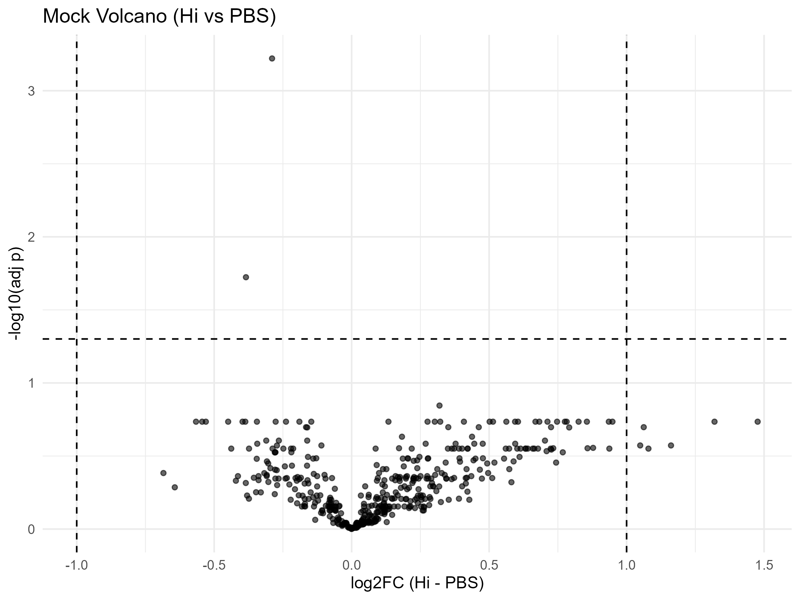
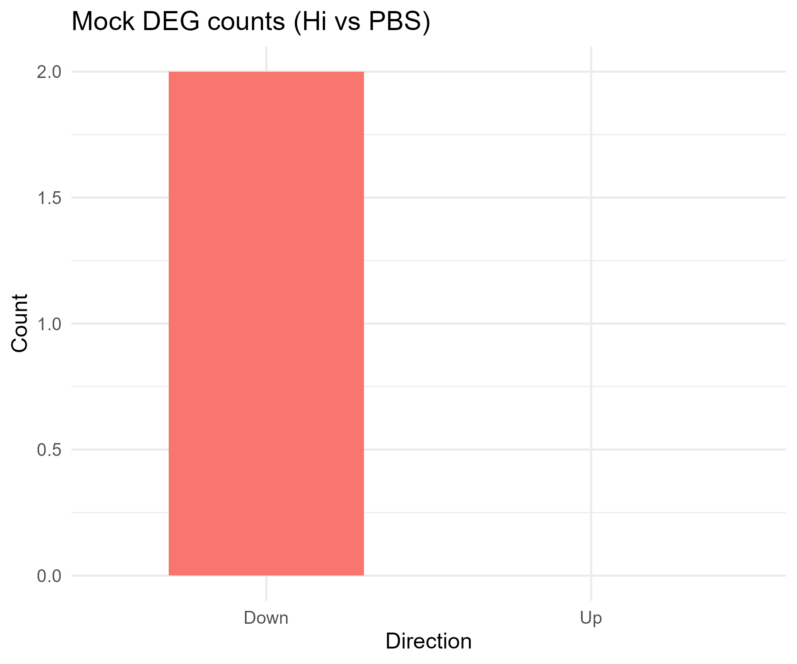
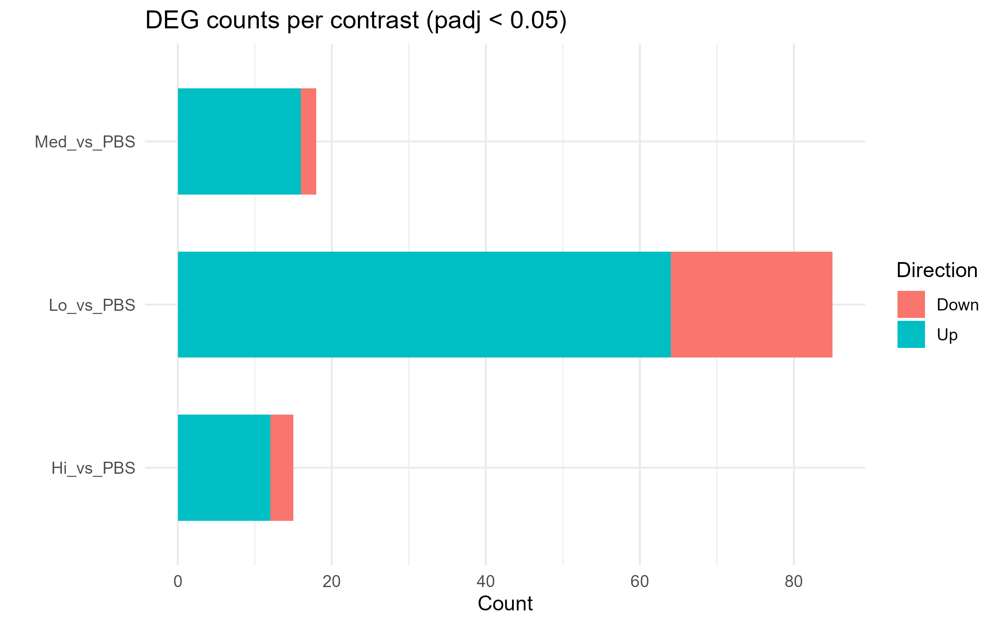

# Normalized (CPM) Figures

Plots are generated by `R/normed_all.R` on **log2(CPM+1)** values. Each image is followed by a concise, plot‑specific explanation. While producing these outputs, data/normed_cpms_filtered_annot.csv was used instead of raw dataset.

## QC SampleCorrelation

Sample–sample **correlation heatmap** (Pearson) using normalized logCPM. Block-diagonal patterns indicate replicates cluster by **Group**; outliers stand out as low-correlation columns/rows.

---

## PCA normed CPM

**PCA** on normalized expression with samples colored by **Group** and 95% ellipses. Separation between ellipses suggests treatment effects; tight ellipses indicate consistent replicates.

---

## Violin Top20 logCPM

Top 20 **most variable genes** by variance on log2(CPM+1). Each violin shows the **per-sample distribution** per group (PBS/Lo/Med/Hi), with jittered points and group means. Use this to spot genes with strong group-wise shifts and heterogeneity.

---

## Trend Genes MeanSEM Top20

For the same **Top 20 variable genes**, line plots display **group means ± SEM** across PBS→Lo→Med→Hi. Helps see monotonic dose trends or non-linear responses at a glance.

---

## Trend TopVar MeanSEM

Mean±SEM trends for a broader set of high-variance genes, highlighting patterns (e.g., steady increases from PBS to Hi) that might not appear in differential tests alone.

---

## Heatmap Top20 rowZ

**Row‑Z heatmap** of the **Top 20 variable genes**. Row-wise Z-scoring emphasizes **relative** up/down per gene across samples; columns grouped by **Group**.

---

## Heatmap Top50 logCPM

Heatmap of **Top 50 expressed/interesting genes** on **log2(CPM+1)** scale (no row‑Z). Color encodes absolute expression differences; complements the row‑Z heatmap.

---

## Heatmap DE Hi vs PBS

Heatmap of **FDR-significant DE genes** for the specified contrast (e.g., Hi vs PBS) using normalized expression. Useful to verify that DE genes co-vary within groups.

---

## DE Volcano mock Lo vs PBS

Mock volcano using **Welch t-tests** on normalized logCPM for Lo vs PBS (stand‑in for the limma pipeline). Highlights genes with large |log2FC| and small **adjusted** p-values; good sanity check on normalized data.

---

## DE Volcano mock Hi vs PBS

Same mock volcano but **Hi vs PBS**. Often fewer FDR‑significant genes than Lo, reflecting either smaller effects or higher variance.

---

## DE BarCounts mock Hi vs PBS

Bar counts of **Up/Down** DEGs for **Hi vs PBS** from the mock test. Typically shows fewer hits than Lo vs PBS under the same thresholds.

---

## DE BarCounts byContrast

Stacked comparison of **DEG counts** (Up/Down) across several contrasts under uniform thresholds, summarizing which comparisons are most differential.

---
